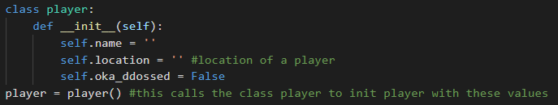
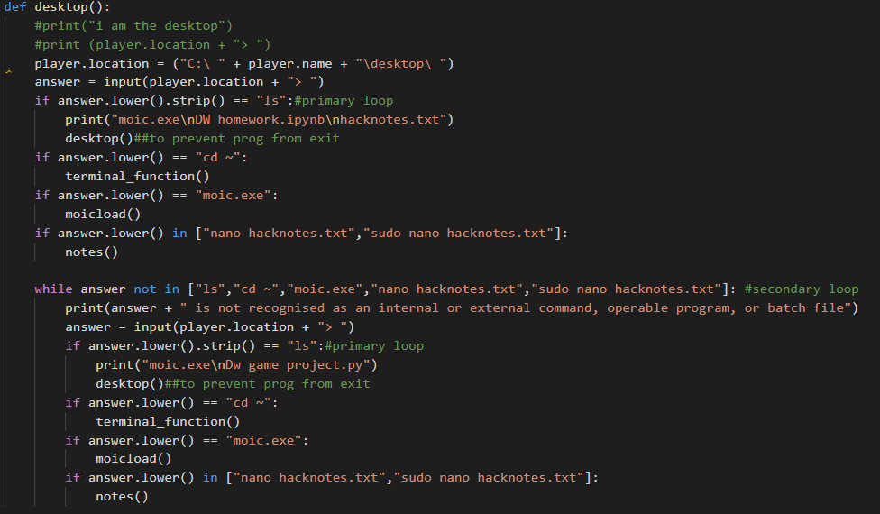
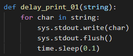
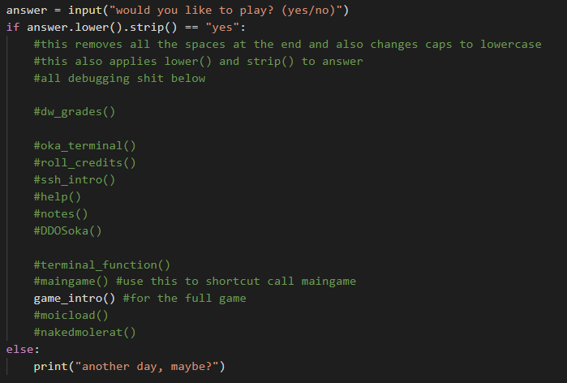
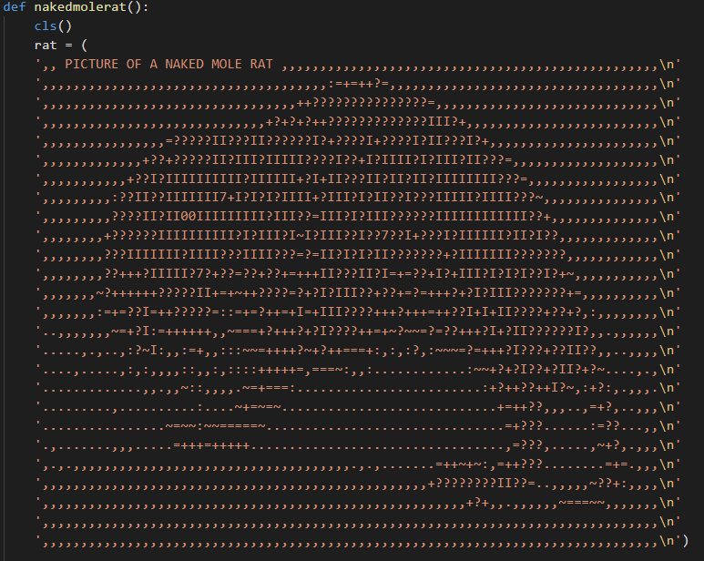

```
 _ ________ _          _  _     __       ____   __    _____        __    ___   _              __  
| |__ /__ /| |_  /\  /\ || |   / _\ /\ /\__ /  /__\  /__   \/\  /\/__\  / _ \ /_\    /\/\    /__\ 
| ||_ \|_ \| __|/ /_/ / || |_ / /  / //_/|_ \ / \// _  / /\/ /_/ /_\   / /_\///_\\  /    \  /_\   
| |__) |_) | |_/ __  /|__   _/ /__/ __ \ __) / _  \|_|/ / / __  //__  / /_/\/  _  \/ /\/\ \//__   
|_|___/___/ \__\/ /_/    |_| \___/\/  \/|___/\/ \_/   \/  \/ /_/\__/  \____/\_/ \_/\/    \/\__/   
```
  ## Introduction
A game I made for digital world assignment.  
This game was created for me to learn simple TUI (text-based user interface), as well as simple OOP and simple recursive functions.  
This game made to be able to be fully run on any python program that has a terminal.  
In time, I will make it into an executable (.exe)  
It does not require any downloads, installs, or external libraries. This was a constraint given to me for the purposes of this game, or else I would have used the curses library as it is a prebuilt library.  
  
  ## Description
```
You are playing as an elite hacker that even cs students look up to.  
A student wants you to hack into the school network and change his DW grades.  
He promises you a great sum of money as compensation.  
  
To do that, you have to ddos the school network,  
then ssh into one of the prof's computer and change the student's grades.
```  
  
  `This is an educational puzzle game intended for people new to linux shell navigation, to let them get used to the shell commands. It is made to be as realistic as possible.`
  
While not 100% factually correct, this game serves as a beginner tutorial on shell navigation in linux.  
Perhaps, in future, if time permits, I will add in more functions, and levels will get progressively harder and more complicated.  
  
  
  
## Controls and how to play the game    
You are to type commands to navigate the command terminal.  
  
`cd`- change directory  
  `cd ~` to move to home directory  
  `cd desktop` to move to desktop directory  
`ls`- lists all available files  
  
  to open programs, `[programname].exe`  
  to exit programs, `z`  
  to read files, `nano [filename]`  or `sudo nano [filename]`. this includes the extension at the end.  
  an example is `nano readme.txt`  
  
  to ssh, `ssh [username]@[ip address]` in the home directory.  
  
  these are only some of the controls. as it is a puzzle game, it is up to the player to navigate and find the help files and commands to win the game.
  
  ## Navigation
  ALL information on what to type in the terminal can be found in the numerous help files and notes located in my virtual terminal in this game. the user is expected to find them and use them, to complete the game.
  
  ## Code Organisation  
  ### OOP
    
  Makes use of OOP to initialise player with values. These values will be changed accordingly within the game when needed to change.  
  
  ### Function Calling
    
  Each location in the terminal makes use of function calling. Each location is a function. To do the `ls` command, I had to make use of recursion to prevent the program from exiting. Each function was then carefully tested, then tailored such that this recursion would not cause any problems. Each function has a primary and secondary loop. This is because there are 2 possibilities on the first try : either the person gets it right or he does not. This loop ensures no glitches.  
  
  ### Text is printed like in a game
      
  delayprinter makes use of a function and an input, and the sys module. It will flush the memory buffer then print the characters one by one with a delay. My game has several delayprinters of different delays.  
  ### Debugging
    
  debugging makes use of shortcuts to warp for easier debugging. This is also the main game loop to call the first function.  
  
  ### ASCII ART
      
  easter egg by ascii art (a hidden joke)  
  
  
## Video link
https://vimeo.com/412291524  

## Github link
https://github.com/BruttherJOE/l33th4ck3r_the_game
  
## Disclaimer
I do not hold any liability or responsibility for any wannabe hackers that cause damage to property or infrastructure of any sort.  
  
  Do not attempt to DDOS anyone. This is against the law in most states and it will be easy for you to be caught.  
  
  I do not endorse any form of cyber attack.
  
`copyright© bruttherjoe 2020`
